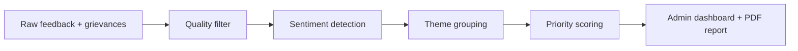

# EduPulse AI Model Decision

## Goal

EduPulse AI is designed for college feedback analysis, not open-ended chatting.
The AI has to do four jobs reliably:

1. Remove duplicate, spam, random, and low-value feedback.
2. Detect sentiment from student comments and grievances.
3. Group similar issues into themes.
4. Prioritize issues into Low, Medium, High, and Critical action items.

## Final AI Approach



## Why Not Only Gemini / ChatGPT?

We do not use only an LLM API because institute feedback can contain thousands
of repeated, sensitive, and low-quality responses. Sending everything directly
to an LLM would be expensive, slower, harder to explain, and harder to audit.

EduPulse first converts raw feedback into structured signals using a local AI
pipeline. An LLM can be added later only for final wording, report polishing, or
summary enrichment.

## Model Choices

### Sentiment: RoBERTa

RoBERTa is used for text sentiment because it understands sentence context
better than simple keyword matching.

Example:

- "Faculty explains clearly" -> Positive
- "Wi-Fi is unavailable for three days" -> Negative
- "Ragging near hostel gate" -> Critical because rule layer catches safety risk

In demo mode, EduPulse uses deterministic fallback logic so the project runs
without first-time model download delays. When enabled, the service loads:

`cardiffnlp/twitter-roberta-base-sentiment-latest`

### Themes: BGE / E5 Embeddings

BGE/E5 converts feedback text into vectors, so similar complaints can be grouped
even when students use different words. This is stronger than simple keyword
matching and stronger than the earlier MiniLM default.

Example:

- "Wi-Fi is slow"
- "Internet is not working"
- "Network is unavailable in labs"

These can be grouped as one Wi-Fi/infrastructure theme.

Default embedding model:

`BAAI/bge-small-en-v1.5`

Optional larger model:

`intfloat/e5-base-v2`

### Clustering: HDBSCAN

EduPulse now prefers HDBSCAN density clustering over fixed KMeans clustering.

Why:

- It finds natural issue groups.
- It does not force every comment into a cluster.
- It can mark noisy/outlier comments.
- It is better for real student feedback where issue volume changes every
  semester.

If HDBSCAN or embeddings are unavailable, the service falls back to MiniBatch
KMeans and TF-IDF so the demo does not break.

### Fake Feedback: Rule-Based Quality Filter

Fake/useless feedback filtering is intentionally rule-based because it must be
fast, explainable, and cheap.

The filter catches:

- Very short feedback: `ok`
- Repeated characters: `aaaaaaa`
- Repeated words: `good good good good good`
- Random numeric text: `1234567890`
- Duplicate comments under the same category

This is easier to defend than asking an LLM to guess whether every comment is
fake.

## Scalability

For 20,000 feedback responses:

- Quality filtering is linear and fast.
- Sentiment runs in batches.
- Embedding generation runs in batches.
- Clustering uses MiniBatchKMeans, which is designed for larger datasets.
- The AI service is separate from the NestJS backend, so it can scale as a
  separate process/container.

## Bias And Outlier Handling

EduPulse does not blindly trust every comment. It flags:

- Duplicate comments.
- Very low sample sizes.
- Repeated/spam-like responses.
- Extreme safety-related grievance signals.
- Department-wise satisfaction differences.

This helps admins avoid unfair decisions from one angry comment while still
escalating serious complaints.

## Current Proof

The repo includes a labeled AI evaluation set:

`ai-service/evaluation/labeled_feedback.json`

Run:

```powershell
python ai-service/evaluation/evaluate_ai.py
```

The script generates:

`docs/ai-evaluation-report.md`

Current benchmark result:

- Quality filter accuracy: 100%
- Sentiment accuracy: 100%
- Theme coverage: 100%
- Urgent priority recall: 100%

## Human Correction Loop

EduPulse now exposes a correction endpoint:

`POST /human-feedback`

Admins can store corrections such as:

- AI marked sentiment wrong.
- AI grouped a theme incorrectly.
- AI priority should be higher/lower.
- AI filtered useful feedback as spam.

The corrections are stored locally in:

`ai-service/data/human_corrections.jsonl`

This creates the base for real institute-specific fine-tuning later.

Important caveat: this is a small labeled hackathon benchmark, not a claim of
universal production accuracy. In a real institute rollout, the same evaluation
framework would be expanded with real anonymized feedback across multiple
semesters.

## Future Human Feedback Loop

Industry version should allow admins to correct AI output:

- Mark theme as correct/incorrect.
- Merge duplicate themes.
- Change priority.
- Mark false spam/fake feedback.

Those corrections can become new labeled data for improving the next model
version.
